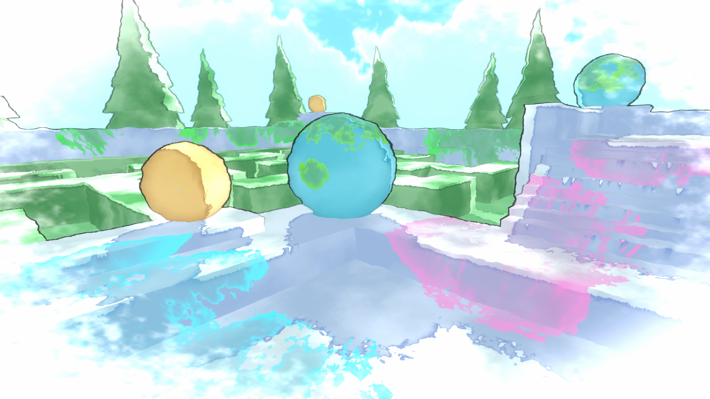

# Watercolour Shader Experiments (for Universal RP)
A few experiments with watercolour-like shader effects made using Shader Graph. Unity 2020.1.2f1, URP 8.2.0 

Includes scene shown in image (though slightly edited/updated), 3 main watercolour shaders, as well as a skybox shader. 
 
• **Object Shader** : Objects/Meshes in the scene have a shader which uses a noise texture with the Triplanar node. This samples the texture 3 times, "projecting" it onto objects from each axis. This is more expensive but prevents the noise having obvious seams that could be produced with regular model uvs. The shader also samples the main light's shadowmap to apply a watercolour shadow effect (which looks best with smooth shadows enabled). 
• **Image Effect / Blit Shader** : There’s an image effect shader over the entire screen which uses a Blit Renderer Feature to apply it. This shader is responsible for the outlines effect, slight distortion and the noisy white vignette to give the effect of the watercolour paint fading out at the edges of the screen. 
• **Decal Shader** : A few watercolour paint splodges have also been placed around the scene using a shader that reconstructs the world position from the Scene Depth, and transforms it into object space to project textures/noise onto other meshes – essentially what a decal is, but probably not the best way to achieve decals. If this was used in an actual game it would also project on the player as it walks through. Also be aware that the camera cannot go into the decal mesh or the effect disappears. 
 
A breakdown of the shader graphs can be found here : https://cyangamedev.wordpress.com/watercolour-shader-experiments 
 
@Cyanilux 
:)
